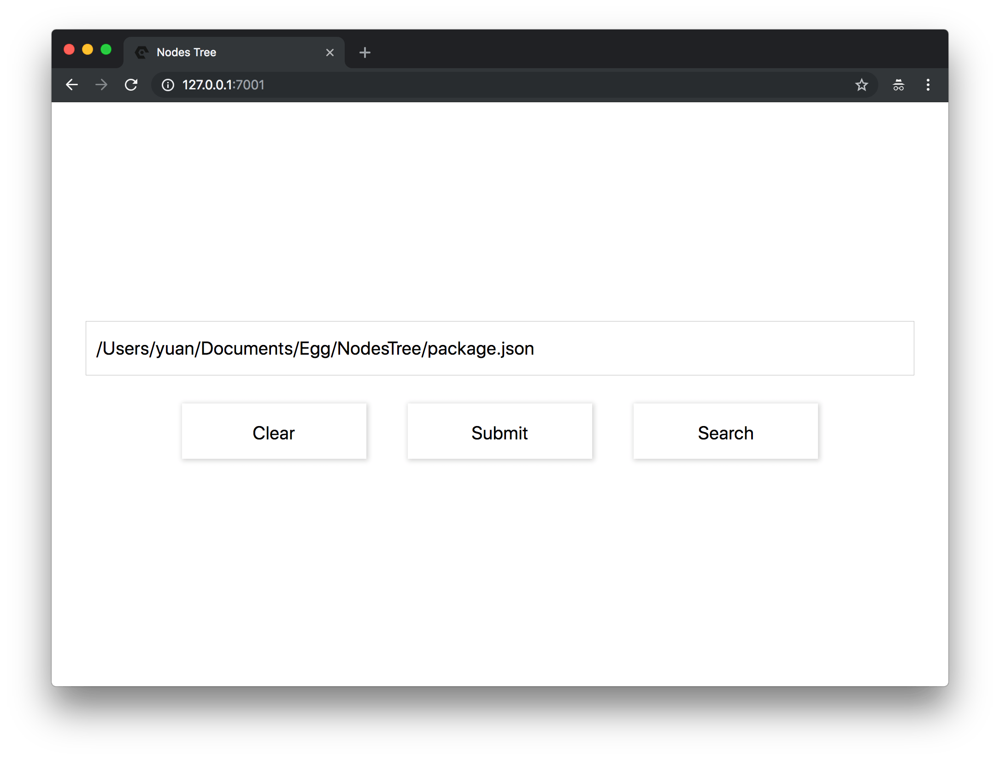

# NodesTree
This project can help you know about that which `npm packages` used in your project.<br>
Only supported `Chrome Browser`.
* [Egg](https://eggjs.org/en/intro/index.html)
* [Art Template](https://aui.github.io/art-template/docs/index.html)

## Screenshot



## QuickStart

<!-- add docs here for user -->

see [egg docs][egg] for more detail.

### Development

```bash
$ npm i
$ npm run dev
$ open http://localhost:7001/
```

### Deploy

```bash
$ npm start
$ npm stop
```

### npm scripts

- Use `npm run lint` to check code style.
- Use `npm test` to run unit test.
- Use `npm run autod` to auto detect dependencies upgrade, see [autod](https://www.npmjs.com/package/autod) for more detail.


[egg]: https://eggjs.org