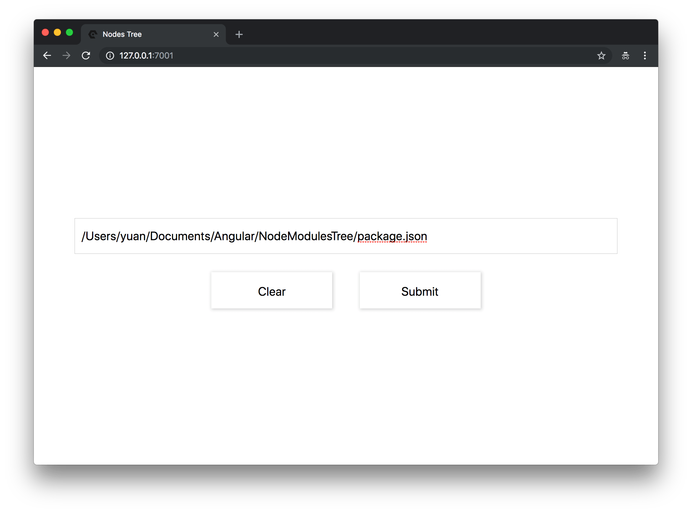
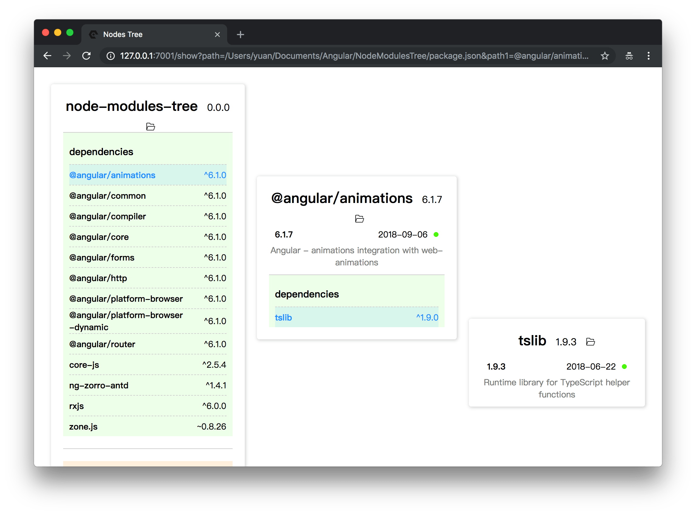
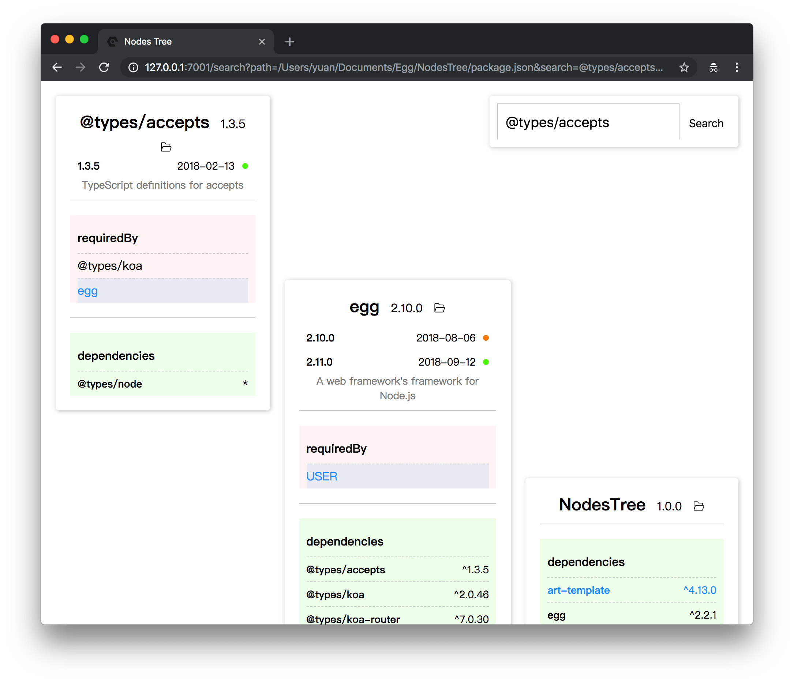

# NodesModulesTree
开发`Node.js`项目过程中，`node_modules`文件夹下有茫茫多第三方库，其中的库之间的依赖关系和版本是否过期也很难理清。所以我尝试开发了`NodesModulesTree`来帮助我理清这些第三方库的依赖关系和版本信息。<br>
* [Egg](https://eggjs.org/en/intro/index.html)
* [Art Template](https://aui.github.io/art-template/docs/index.html)

## 截图





## 快速入门

<!-- 在此次添加使用文档 -->

如需进一步了解，参见 [egg 文档][egg]。

### 本地开发

```bash
$ npm i
$ npm run dev
$ open http://localhost:7001/
```

### 部署

```bash
$ npm start
$ npm stop
```

### 单元测试

- [egg-bin] 内置了 [mocha], [thunk-mocha], [power-assert], [istanbul] 等框架，让你可以专注于写单元测试，无需理会配套工具。
- 断言库非常推荐使用 [power-assert]。
- 具体参见 [egg 文档 - 单元测试](https://eggjs.org/zh-cn/core/unittest)。

### 内置指令

- 使用 `npm run lint` 来做代码风格检查。
- 使用 `npm test` 来执行单元测试。
- 使用 `npm run autod` 来自动检测依赖更新，详细参见 [autod](https://www.npmjs.com/package/autod) 。


[egg]: https://eggjs.org
